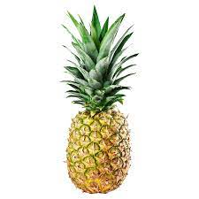

# Title

## Smaller Title


Hi this is my text. I am typing something new.

```sql
SELECT *
FROM table
```

In-line can work too `SELECT * FROM table` with this formating.

* 1,2,3
* A,B,C
  * New layer
    * New New Layer

1. This is a ordered list
2. This is item two

>Block quotes are a thing too.

Hover over pic to see caption

 

[Link to Title section above](#title)

